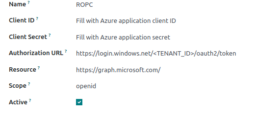

The configuration of this module is based with Microsoft Azure ad OAuth provider

https://learn.microsoft.com/en-us/azure/active-directory/develop/v2-oauth-ropc

To configure this module, you need to:

#. Go to Settings/Users/OAuth ROPC providers and create a new one

